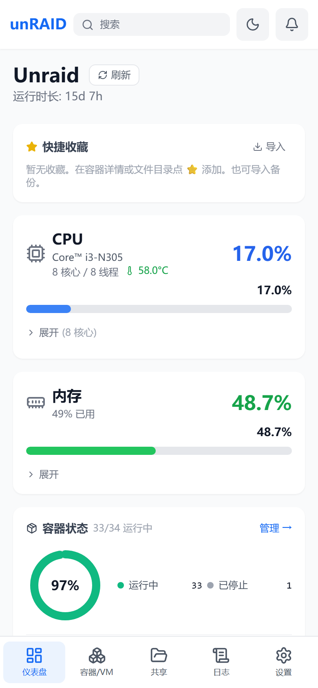
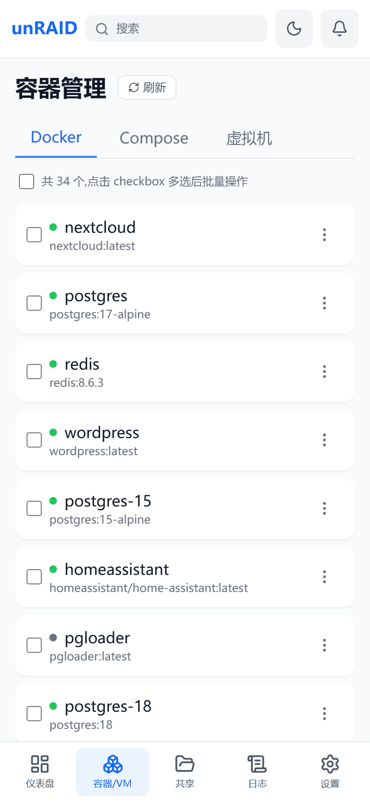
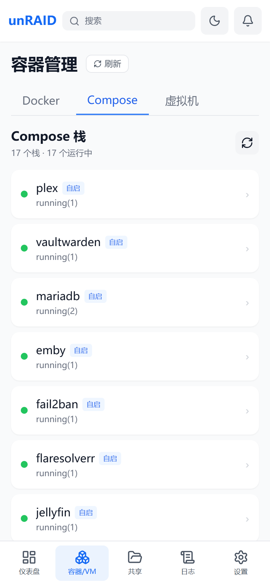
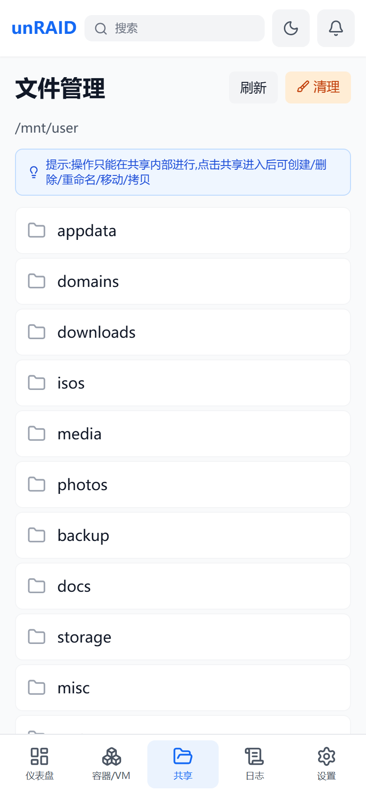
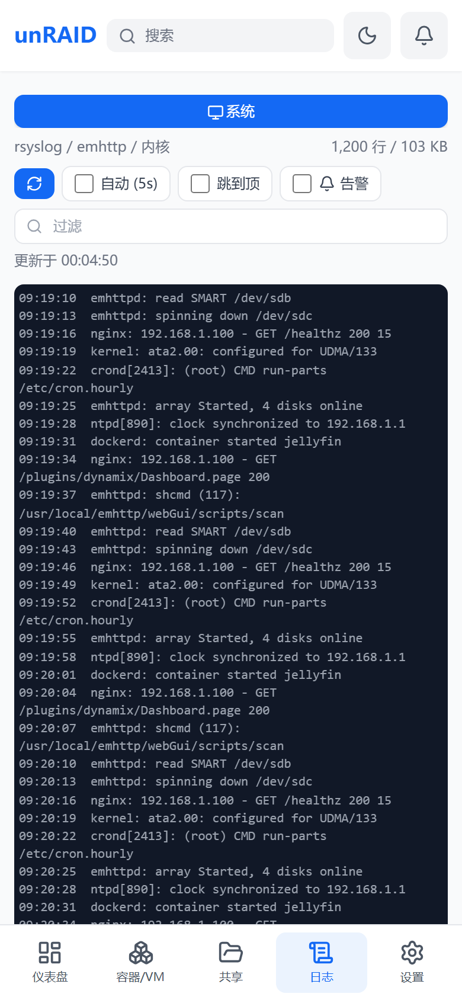
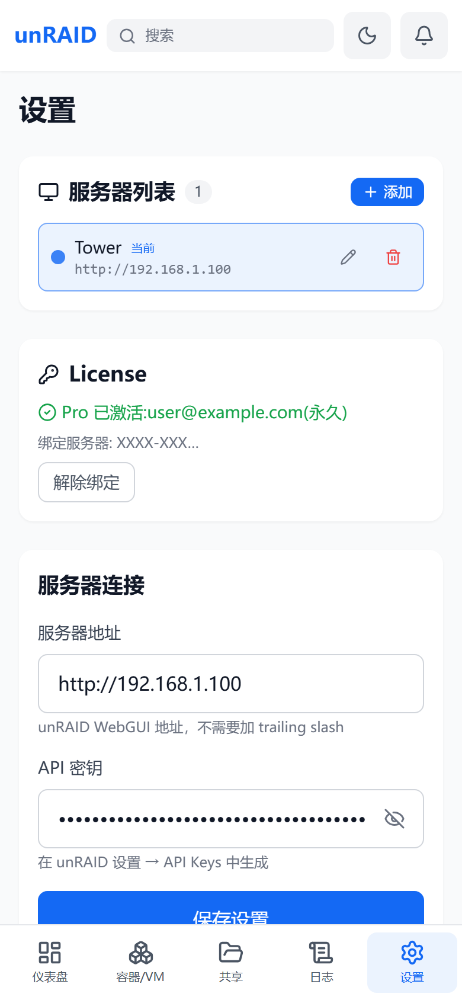

# unRAID Mobile — Docker Compose 部署

**[English](README.md)** | 简体中文

[](https://t.me/+l1iA02ZkOK1lNmEx)

专为移动设备优化的 unRAID 服务器管理界面,以单 Docker 镜像分发
([`bear0328/unraid-mobile`](https://hub.docker.com/r/bear0328/unraid-mobile))。
数据走 unRAID GraphQL API(7.2+;磁盘休眠图标和网络速率统计需要 unRAID 7.3+ /
unraid-api ≥ 4.20,老版本会自动降级,仅缺少这两项,其余功能正常)。

> **本仓库只放部署资产**——docker-compose 文件、unRAID Docker UI 模板、可选的宿主后端
> (compose-api)。应用本体已转为**闭源**,以 Docker Hub 镜像分发,这里不需要构建任何东西。

## 界面截图

| 仪表盘 | 容器 / VM | Compose 栈 |
|---|---|---|
|  |  |  |

| 共享文件 | 日志 | 设置 / License |
|---|---|---|
|  |  |  |

## 功能(免费版 / Pro)

| 免费版(开箱即用) | Pro(License key 解锁) |
|------|------|
| 仪表盘全部监控:CPU / 内存 / 网络 / 磁盘 / 阵列 / parity 校验进度 / 历史曲线 / 收藏、unRAID 告警徽章 | 容器 / VM 启停 / 重启 / 暂停 / 恢复操作、**VM 增强详情**¹(CPU/内存/磁盘/网络/直通/快照,读 libvirt XML) |
| 容器 / VM 列表、容器详情(端口/挂载/网络/磁盘占用)、容器日志、VM 基础详情 | **Compose 栈管理**(列表/日志/up/down/pull/rebuild/yaml 编辑)¹ |
| Shares 文件浏览 / 下载 / 图片预览、宿主系统日志(syslog) | **CPU 温度**¹(直读 /sys/class/hwmon,不唤盘)、Shares 写操作(上传/新建/删除/重命名/文本编辑) |
| 全局搜索、命令面板、配置备份/导入、单服务器、深色主题、PWA | **容器一键更新**(单个/批量,webGui 同款)、**UPS 监控**(电量/续航/负载)、容器批量操作、**多服务器**、告警通知(Webhook)、磁盘清理 |

¹ 依赖宿主后端(compose-api)——需按下方「Pro 宿主后端」一节在 unRAID 宿主安装小组件,
**安装会修改开机脚本 `/boot/config/go`,请先知悉其中的风险说明**。免费版无需安装任何东西。

**宿主后端依赖原则**:Compose 管理 / CPU 温度均依赖宿主 `api.php`
(安装到 `/boot/config/plugins/unraid-mobile/`),此类功能均为 Pro。

Pro 为**买断制**:一次付费永久使用(含 1 年更新)。在「设置 → License」输入 key 即解锁,
全程离线验证,不联网、不上传任何数据。购买渠道见 GitHub Releases / 后续公告。

## 快速开始(Docker Hub 镜像)

```bash
docker run -d \
  --name unraid-mobile \
  -p 3999:80 \
  -e UNRAID_UPSTREAM=http://192.168.1.100:8001 \
  -v /mnt/user/appdata/unraid-mobile/config:/usr/share/nginx/html/config \
  bear0328/unraid-mobile:latest
```

`UNRAID_UPSTREAM` 填你的 unRAID webGui 地址(不带尾部斜杠)——容器内 nginx 把 `/graphql`
反代到这里。**填错则全部 API 请求 502。**

打开 `http://<unraid-IP>:3999`,进「设置」页填:

1. **服务器地址** — 如 `http://192.168.1.100`(填 unRAID webGui 地址,不带尾部斜杠)
2. **API 密钥** — unRAID GraphQL API key(webGui → Settings → API Keys 生成)

> apiKey 只存在你自己浏览器的 localStorage,**不会**写到服务器任何文件。

镜像 tag:`latest`(最新稳定) / `1.2.4`(固定版本)。仅 linux/amd64(unRAID 平台)。

### 方式二:docker-compose

直接用本仓库现成的 [`docker-compose.yml`](docker-compose.yml):

```bash
curl -fsSL -o docker-compose.yml \
  https://raw.githubusercontent.com/bear0328/unraid-mobile-compose/master/docker-compose.yml
# 先改 UNRAID_UPSTREAM,再:
docker compose up -d
```

### 方式三:unRAID Docker UI 模板

不习惯命令行的话,可以用模板 [`templates/unraid-mobile.xml`](templates/unraid-mobile.xml)
在 Docker 标签页里填表部署:

```bash
# 在 unRAID 宿主上以 root 执行
curl -fsSL -o /boot/config/plugins/dockerMan/templates-user/my-unraid-mobile.xml \
  https://raw.githubusercontent.com/bear0328/unraid-mobile-compose/master/templates/unraid-mobile.xml
```

然后:Docker 标签页 → **Add Container** → 模板下拉选 **unraid-mobile** →
填 `UNRAID_UPSTREAM` → Apply。文件管理/日志/Compose 等可选挂载在高级区,
不需要的行删掉即可。

### 功能 ↔ 挂载对照表

基础功能(仪表盘/容器/VM/设置)**零挂载可用**。进阶功能按需加挂载:

| 功能 | 挂载 / 依赖 | 说明 |
|------|------------|------|
| 配置持久化 | `-v .../config:/usr/share/nginx/html/config` | 只存 serverUrl,建议加 |
| 文件管理 | `-v /mnt/user:/mnt/user` + `-v /mnt/cache:/mnt/cache` + WebDAV 密码文件 | 密码在设置页输入,与 nginx `.davpasswd` 一致 |
| 宿主系统日志 | `-v /var/log:/mnt/hostlog:ro` + 日志密码文件 | 同上,`.logpasswd` |
| Compose 栈管理 / CPU 温度(Pro) | `-v /var/run/php-fpm.sock:/hostrun/php-fpm.sock` + 宿主后端 | 见下节 |

完整 docker-compose 示例:

```yaml
services:
  unraid-mobile:
    image: bear0328/unraid-mobile:latest
    container_name: unraid-mobile
    ports:
      - "3999:80"
    environment:
      - UNRAID_UPSTREAM=http://192.168.1.100:8001  # 改成你的 unRAID 地址
    volumes:
      - /mnt/user/appdata/unraid-mobile/config:/usr/share/nginx/html/config
      # 按需取消注释:
      # - /mnt/user:/mnt/user
      # - /mnt/cache:/mnt/cache
      # - /var/log:/mnt/hostlog:ro
      # - /var/run/php-fpm.sock:/hostrun/php-fpm.sock
    restart: unless-stopped
```

## Pro 宿主后端(compose-api):Compose 栈管理 + CPU 温度

Compose tab 和 CPU 温度(均为 Pro 功能)依赖一个宿主端小组件(`api.php`,经宿主 php-fpm
以 root 执行 `docker compose` / 直读 `/sys/class/hwmon`,不会唤醒休眠硬盘)。
未安装时对应功能显示安装指引或占位,**其余功能不受影响**。
宿主后端源码完整公开在 [`compose-api/`](compose-api/),以 root 跑在你服务器上的东西,
每一行都可以自行审计。

> ⚠️ **风险说明(安装前必读)**
> 安装脚本会修改以下持久宿主文件(均带【unraid-mobile】标记,可完整还原):
> - `/boot/config/go`:开机脚本,追加恢复钩子(6 行),用于重启后恢复 Pro 后端组件、清理 Compose 残留锁
> - `/boot/config/plugins/unraid-mobile/api.php`:Pro 后端(Compose / CPU 温度 / VM 详情)flash 正本
> - `/boot/config/plugins/unraid-mobile/update-status.php`:Compose 更新徽章回写脚本 flash 正本
> - `/boot/config/plugins/unraid-mobile/apikey`:API key 的 sha256 哈希(600,明文不落 flash)
> - `/boot/config/plugins/unraid-mobile/audit.log`:api.php 关键操作审计日志
> - `/boot/config/go.unraid-mobile-bak`:安装前自动备份的 `go` 文件
>
> 保障措施:
> - 修改前自动备份 `/boot/config/go` 为 `/boot/config/go.unraid-mobile-bak`
> - 仅追加带【unraid-mobile】标记的恢复钩子,不改动你已有的任何行
> - 脚本执行时会要求输入 `YES` 显式确认
> - 卸载:删除 `/boot/config/plugins/unraid-mobile/` 和 `go` 里标记的恢复钩子即完全还原
>
> 如果你不接受对开机脚本的任何修改,不要安装 —— 免费版的全部功能都不需要它。

安装前提:已通过 Community Applications 安装 **compose.manager** 插件。

```bash
# 在 unRAID 宿主上以 root 执行
mkdir -p /tmp/um-install && cd /tmp/um-install
curl -fsSL -o install-compose-api.sh \
  https://raw.githubusercontent.com/bear0328/unraid-mobile-compose/v1.2.9/compose-api/install-compose-api.sh
curl -fsSL -o api.php \
  https://raw.githubusercontent.com/bear0328/unraid-mobile-compose/v1.2.9/compose-api/api.php
bash install-compose-api.sh
```

脚本会:风险确认(输 YES)→ 校验 compose.manager → 交互式收 apiKey 写入
`/boot/config/plugins/unraid-mobile/apikey`(600,存 `sha256:` 哈希,明文不落 flash 盘)
→ 装 api.php 到 compose.manager 插件目录 → 备份并加 `/boot/config/go` 恢复钩子。幂等,可重复跑。

装完给容器加上 php-fpm.sock 挂载并重建,Compose tab 与 CPU 温度(Pro 激活后)即可用。

## unRAID GraphQL API 限制说明

### Docker 容器
| 功能 | 支持 | 字段 |
|------|------|------|
| 列表 | ✅ | id, names, image, state, status, autoStart, created |
| 日志 | ✅ | logs(tail) { lines { timestamp, message } } |
| 统计 | ✅ | stats { cpuPercent, memUsage, memPercent }(订阅) |
| 启停 | ✅ | mutation |
| 端口映射 / 挂载 / 网络 / 磁盘占用 | ✅ | ports / mounts / networkSettings / size*(详情查询) |

### 虚拟机
| 功能 | 支持 | 字段 |
|------|------|------|
| 列表 | ✅ | domains { name, uuid, state } |
| 启停 | ✅ | mutation |
| 日志 / 内存 / CPU / 磁盘 / 网络 / 直通 / 快照 | ✅(Pro) | 通过 compose-api / api.php 读取 libvirt XML(GraphQL 无此字段) |

## 更新日志

完整历史见 [CHANGELOG_CN.md](CHANGELOG_CN.md)。

### v1.2.9(2026-09-19)

- Webhook 通知大扩展:新增飞书群机器人 provider(可选签名密钥);事件源从仅容器扩到 12 个、逐项开关——VM 停止、UPS、奇偶校验、磁盘状态/温度、阵列启停、unRAID 原生告警转发、日志关键字、CPU/内存/CPU 温度阈值(阈值+迟滞+冷却可调)。原生告警按标题去重,6 小时窗内同标题只推一次。修复 iOS 主屏 PWA 顶栏模糊——**老用户需删除主屏图标重新添加才能生效**。纯前端版本,compose-api 与 v1.2.8 相同

### v1.2.8(2026-09-19)

- 全局搜索移动端优先:文件搜索入口提到输入框正下方;手机输入法回车键显示「搜索」,回车直搜文件(Pro 走索引,免费进唤盘确认);点搜索按钮立即弹键盘;PC 键盘提示(⌘K/Enter/↑↓/Ctrl+S)移动端隐藏。纯前端版本,compose-api 与 v1.2.7 相同

### v1.2.7(2026-09-19)

- 全盘文件索引(Pro):cron 每日定时把 `/mnt/user` 文件名索引构建到 cache 池,文件搜索直读索引——毫秒出结果、零唤盘;设置页新增卡片(开关/整点/手动重建)。文件搜索收敛单入口(Pro 走索引,免费保留实时全盘)。修复 cache-only 软链份额(`strm`、`appdata` 等)被索引/全盘搜索漏掉的问题。需在宿主更新 compose-api

### v1.2.6(2026-09-18)

- 全盘文件搜索:全局搜索新增「在全盘搜索」入口,经 compose-api `?action=search&scope=all` 扫 `/mnt/user`(cache + 全部阵列盘)——需原地二次确认(将唤醒休眠盘,可能耗时 1-2 分钟),无「记住选择」,后端审计留痕;缓存盘无结果时自动引导

### v1.2.5(2026-09-18)

- 全局搜索(Cmd+K)扩展:VM、根分享、Compose 栈(只读缓存,零新请求)+ 分组结果 + 最近搜索 + 英文/拼音别名模糊匹配
- compose-api 新增 `?action=search&q=` 端点:宿主侧文件名搜索,仅扫 `/mnt/cache`(不碰阵列盘、不唤醒休眠盘);支撑全局搜索里显式触发的「在缓存盘文件中搜索」。**需在宿主更新 compose-api**(安装脚本已更新;旧版后端会提示升级)
- 容器管理页新增页内搜索框:一个输入框同时过滤 Docker 容器(名称/镜像/状态)、虚拟机、Compose 栈
- iOS App 套壳(Capacitor 8,Web 端行为零变化)

### v1.2.4(2026-08-23)

- 修复 Docker 容器与 Compose 栈的更新徽章:compose-api 新增 `?action=updates` 端点作为更新状态权威来源,绕过三个上游 unraid-api 问题(每日 digest cron 被官方禁用、GraphQL 不剥 `library/` 前缀、缓存 local digest 被冻结)——官方镜像(如 ms-go)徽章正常显示,pull/rebuild 后即时消除
- 修复 `docker images --digests` 多 RepoDigest 行干扰导致的更新误报(改为逐 ref `docker image inspect`)
- 修复日志较大的栈(如 Teslamate,>64 KB)打开详情或拉取镜像时报 "HTTP 200":日志按字节截断切断多字节 UTF-8 字符,JSON 编码失败返回空响应
- 修复 pull/rebuild 执行中详情弹窗日志区塌陷的问题

### v1.2.3(2026-08-21)

- 安全加固:`/files` 和 `/dav/` 增加 `Content-Security-Policy: sandbox` 响应头,经 WebDAV 上传的 HTML/SVG 文件被打开时不再能以 app 同源执行脚本窃取存储的 API key(闭合该提权链);图片/文本/下载预览不受影响
- `/files`、`/dav/`、`/var/log/` 三个 location 补 `X-Content-Type-Options: nosniff` 响应头

### v1.2.2(2026-08-14)

- 优化 Dashboard 卡片排序:上移/下移收进手柄弹出菜单,常态只显示拖动手柄,不再遮挡卡片标题;消除 iOS 点按后残留的半透明白框
- 优化 Dashboard 拖拽预览:拖动卡片时跟手预览为正常大小的半透明整卡(圆角+阴影),消除浏览器默认「小白框」
- 修复告警弹层「去 WebUI 查看」在 iOS PWA 打开空白页:统一改为跳 unRAID 登录页,并改用真实链接(不再 JS window.open)
- 文档:README 补充界面截图

### v1.2.1(2026-08-10)

- 修复 Shares 文件管理:`#` 文件名被 URL fragment 截断、中文重命名/移动/拷贝失败(DAV 路径统一编码)
- 修复 Shares 根目录手动刷新 30 分钟内无效
- 修复 Shares 大文件下载/预览被 15 秒超时误伤(延长至 120 秒)
- 修复 Shares 分享链接双重编码导致中文路径 404
- 修复 Safari 下文件列表日期解析可能产出 NaN
- 修复设置页服务器地址带空格/缺协议/格式非法导致保存后显示异常(统一归一化与校验)
- 修复设置页「关于」版本号长期写死的问题(改为构建注入,与 package.json 单一来源同步)

## 常见问题

**Q: 添加了多台服务器,切换后数据没变或 401?**
已知限制:多服务器切换目前只更换 API 密钥,数据请求仍走当前容器的同源代理
(即部署本容器的这台 unRAID)。单服务器使用不受影响;跨机直连在路线图中。

**Q: 有问题去哪讨论 / 反馈?**
加 Telegram 交流群:<https://t.me/+l1iA02ZkOK1lNmEx>,或在 GitHub 提 issue。

**Q: API 连接失败?**
检查服务器地址格式(不带尾部斜杠)、API 密钥是否有效、容器到 unRAID webGui 网络是否通。

**Q: 容器详情里端口/标签/网络是空的?**
容器详情(端口/挂载/网络/磁盘占用)为免费功能;为空则是该容器本身无此配置(如 host 网络无端口映射)。

**Q: 换手机/浏览器后要重输 API 密钥?**
是。apiKey 只存浏览器 localStorage,不跟设备走;服务器端不落任何凭证。

**Q: 应用源码在哪?**
应用本体已闭源(原公开源码仓库已转为私有)。本仓库包含部署与审计所需的一切:
compose 文件、Docker UI 模板,以及宿主后端的完整源码——唯一在你服务器上
以容器外身份运行的组件。

## License 与商业化

- **应用本体**(Docker 镜像 `bear0328/unraid-mobile`)闭源,保留所有权利;
  个人/家庭自托管免费使用。
- [`compose-api/`](compose-api/) 下的**宿主后端**源码为便于审计而公开,以
  **Business Source License 1.1(BSL)** 授权(见 [LICENSE](LICENSE)):
  个人使用与修改自由;**禁止转售、禁止做成收费/托管服务提供给第三方**。

商业化形式:**Pro 功能通过离线 license key 解锁**(设置页输入即可,买断制,不联网验证)。
**1 枚 key 绑定 1 台 unRAID 服务器**(按 U 盘 flashGuid 校验,重装系统不影响;更换 U 盘后
联系重签),**最多可在 3 台设备**(手机/浏览器)上激活,旧设备「解除绑定」即释放名额。
如果你喜欢这个项目,购买 Pro 是对开发最直接的支持。
